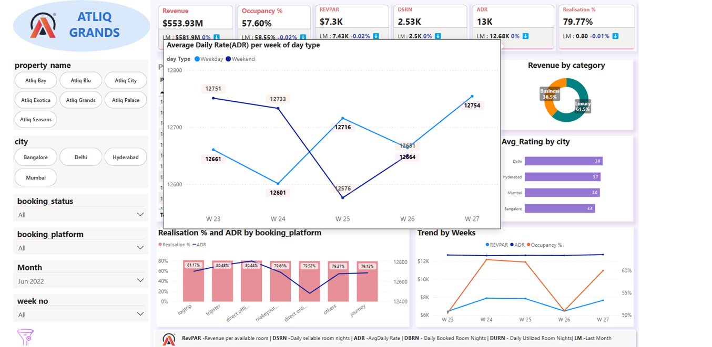

# **AtliQ Grands Hospitality Insights - Power BI Dashboard**

🔗 **[Live Interactive Dashboard](https://app.powerbi.com/view?r=eyJrIjoiOTZkZDU5YTMtNWJiNS00N2U2LWI4NWMtY2QwOTAxMjBhZDNiIiwidCI6ImM2ZTU0OWIzLTVmNDUtNDAzMi1hYWU5LWQ0MjQ0ZGM1YjJjNCJ9)**

---
## **Project Overview**
AtliQ Grands, a premium five-star hotel chain in India, has been experiencing a decline in market share and revenue. To counteract this, the management has decided to incorporate Business and Data Intelligence for informed decision-making. This project provides a comprehensive Power BI dashboard with key performance metrics and actionable insights to help AtliQ Grands regain its competitive edge.

## **Objectives**
- Develop key business metrics to track performance.
- Build an interactive dashboard following stakeholder requirements.
- Identify trends and provide actionable recommendations for revenue growth.

## **Data Model**
The data model consists of multiple tables including:
- **Bookings Data**: Check-in/check-out dates, room type, and booking platform.
- **Revenue Data**: Revenue per available room (RevPAR), average daily rate (ADR), and total revenue.
- **Customer Feedback**: Guest ratings and reviews across properties.
- **Hotel Details**: Location, category, and occupancy capacity.

📌 **Data Model Diagram:**

## **Dashboard Overview**
The interactive Power BI dashboard provides:
- Revenue trends and breakdowns by property.
- Occupancy rate trends to assess utilization efficiency.
- Guest satisfaction analysis based on ratings and reviews.
- Performance comparison across different booking platforms.

📌 **Dashboard Preview:**

📌 **Tooltip Demonstration:**

## **Key Metrics & Insights**
1. **Revenue Performance:**
   - **Total Revenue:** Analyzed across different time periods and properties.
   - **Revenue by Property:** Identifies top-performing and underperforming locations.
   
2. **Occupancy Insights:**
   - **Overall Occupancy Rate:** Displays room utilization effectiveness.
   - **Occupancy by Property:** Highlights variations in demand across locations.

3. **Guest Experience:**
   - **Average Rating:** Measures guest satisfaction levels.
   - **Ratings by Property:** Pinpoints areas for service improvement.

4. **Booking Platform Analysis:**
   - **Platform Contribution:** Evaluates the performance of different platforms in driving revenue.

## **Recommendations**
1. **Improve Occupancy Rates:** Optimize off-peak pricing and introduce targeted promotions.
2. **Enhance Guest Experience:** Address low-rated properties by improving services and amenities.
3. **Optimize Booking Channels:** Focus marketing efforts on high-performing platforms while improving visibility on underutilized ones.
4. **Implement Dynamic Pricing:** Introduce variable pricing strategies based on demand fluctuations.

## **Tools & Technologies Used**
- **Power BI** for interactive data visualization.
- **DAX** for custom calculations and measures.
- **Power Query** for data transformation and cleaning.

## **About Me**
I am an aspiring Data Analyst looking for a career transition, with a background as an Engineer in Project Sales. Passionate about transforming raw data into meaningful insights, I aim to leverage analytical skills to drive data-driven decision-making.  

Connect with me on [LinkedIn](https://www.linkedin.com/in/naveen-surla-587565242/) or explore more projects on [GitHub](https://github.com/naveensurla).
